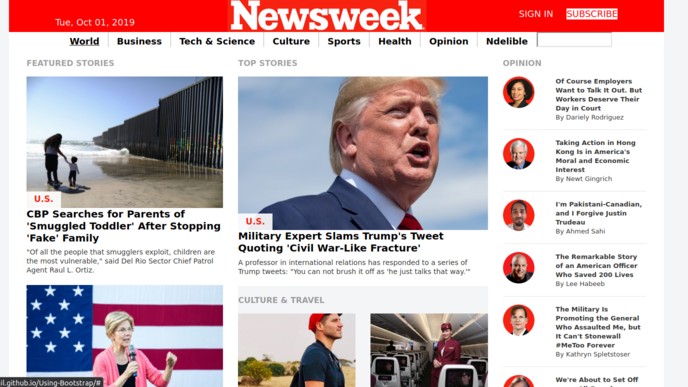

# NewsWeek site with Bootstrap 4

    

This project its a replica of the news site [Newsweek.com](WWW.Newsweek.com) using the Bootstrap framework. This project its 100% responsive, you can seet from any device with out losing the properties of the page.

## Built With

- HTML
- CSS
- Bootstrap 4

## Live Demo

  [Live demo](https://juanpablogil.github.io/NewsWeek-Site-With-Bootstrap-4/)

## Usage

You can clone the repository with the next command

## Getting Started

To get a local copy up and running follow these simple example steps.

### Prerequisites

Clone the project or download the [project]('https://github.com/JuanPabloGil/Weather-App-Javascript/archive/dev.zip').

    $ git clone https://github.com/JuanPabloGil/Using-Bootstrap.git

    After downloading the project or clone it you can just open the repository and run the index.html in your favorite browser.

## Contributing

   Fork it (https://github.com/JuanPabloGil/Using-Bootstrap/fork)
   Create your feature branch (git checkout -b feature/fooBar)
   Commit your changes (git commit -am 'Add some fooBar')
   Push to the branch (git push origin feature/fooBar)
   Create a new Pull Request

## Author

   👤 **Juan Pablo Gil**

   - [GitHub](https://github.com/JuanPabloGil )
   - [@LinkedIn](https://www.linkedin.com/in/juan-pablo-gil-1321a515a/)
   - jpablomgil@gmail.com

## 🤝 Contributing

   Contributions, issues and feature requests are welcome!

   Feel free to check the [issues page](https://github.com/fivan18/todo-list/issues).

   ## Show your support

   Give a ⭐️ if you like this project!

## 📝 License

   This project is [MIT](LICENSE) licensed.
